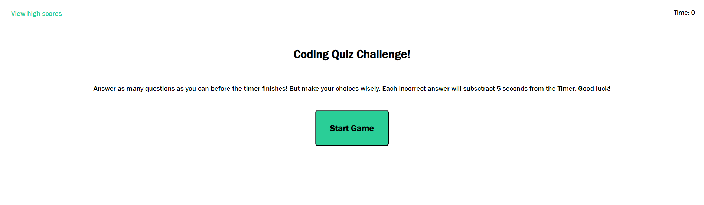

# Coding Quiz App

## Description

### User Story
AS A coding boot camp student
I WANT to take a timed quiz on JavaScript fundamentals that stores high scores
SO THAT I can gauge my progress compared to my peers

### Acceptance Criteria

GIVEN I am taking a code quiz
WHEN I click the start button
THEN a timer starts and I am presented with a question
WHEN I answer a question
THEN I am presented with another question
WHEN I answer a question incorrectly
THEN time is subtracted from the clock
WHEN all questions are answered or the timer reaches 0
THEN the game is over
WHEN the game is over
THEN I can save my initials and score

## Installation

N/A It's a website!

## Usage

This page will help you hone your coding knowledge with a short quiz on some of the basics in HTML, CSS, and JavaScript. But be careful when choosing an answer! Each wrong choice will deduct time from the timer...

## Credits

Columbia Coding Bootcamp

LeAnne Branch with getting the game to end and helping with the high-score form rendering!

And you for visiting my page!

## License

MIT License